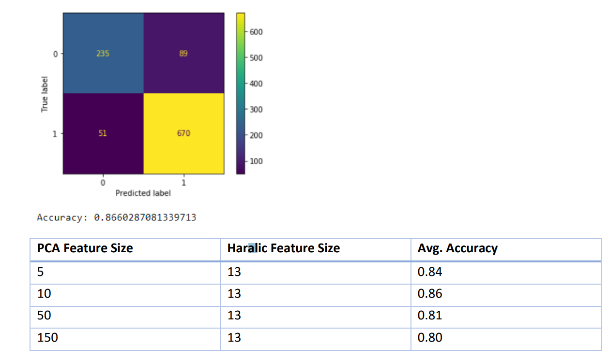
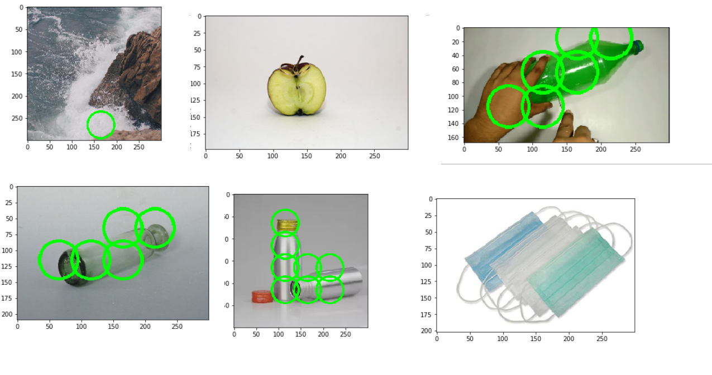

## Detecting Recyclable Objects on Images

This is a machine learning project for detecting recyclable objects in images. Random Forest Classifier is used to classify images. CNN is not used in this project.

#### Training
To train the model a combination of Raw Pixel Features from PCA and Haralick texture features are used.
Training dataset includes 10000 50x50 images 
(7000 Non Recyclable and 3000 Recyclable)

#### Results

